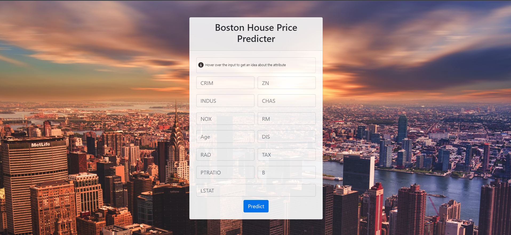
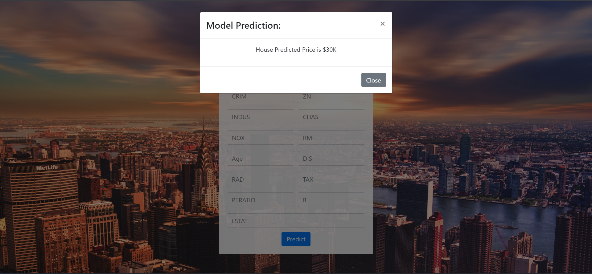

# boston_house_pricing

**My First End-To-End Machine Learning Project**

### Software And Tools Requirements

1. [Github Account](https://github.com)
2. [VS Code IDE](https://code.visualstudio.com/)
3. [HerokuAccount](https://www.heroku.com/)
4. [GitCLI](https://git-scm.com/book/en/v2/Getting-Started-The-Command-Line)

Create a new environment

```
conda create -p venv python==3.9 -y
```

### App Demo:

https://boston-price-prediction-e4373b3e18c8.herokuapp.com/




